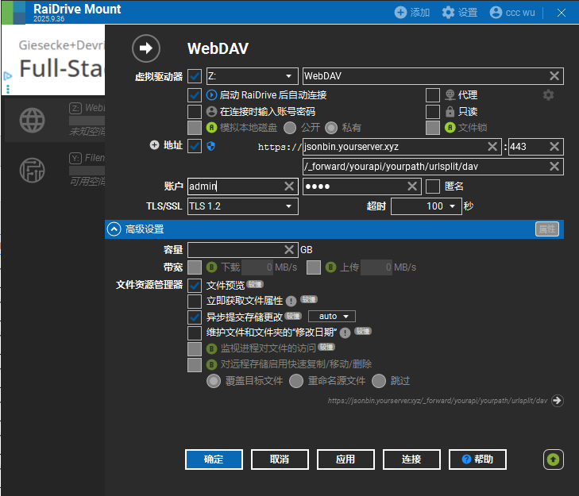

# bash_scripts
scripts to setup v2ray, gost and openlist on Ubuntu(aws vps or koyeb) and Windows.

# Notice
This project heavily relies on [JSONBIN](https://github.com/waxz/json-bin).
Please deploy it first.

## Prepare
#### JSONBIN VARS

```bash
cp .vars.example .vars
```
Modify `.vars` according to your needs.


#### Install dependencies

```bash
sudo -E ./download.sh
sudo -E ./install_cron_jobs.sh
```


## openlist

### server on Ubuntu

All jobs will run at startup.
You can also run script manually.
Admin password is set to `JSONBINKEY` in `.vars`.

```bash
sudo -E ./setup_openlist.sh
```

#### webdav endpoint
```
https://<JSONBINURL>/_forward/<JSONBINOPENLISTPATH>/<JSONBINV2RAYPATH>/urlsplit/dav
```

### raidrive on Windows
[clients for webdav](https://doc.oplist.org/guide/advanced/webdav#client-software)

[raidrive](https://www.raidrive.com/)




## v2ray


### v2ray on Ubuntu

```bash
sudo -E bash ./setup_v2ray.sh 
```

### tor on Ubuntu

```bash
sudo -E bash ./setup_tor.sh
```

### setup v2ray over tor

```bash
sudo -E bash ./setup_v2ray_outbound.sh tor
```


### v2ray subscription
```
https://<JSONBINURL>/<JSONBINV2RAYPATH>/?key=<JSONBINKEY>&q=sub
```

### ttyd

```bash
sudo -E bash ./setup_ttyd.sh 
```

visit your jsonbin domain
```
https://<JSONBINURL>/<JSONBINAWSTTYDPATH>/?key=<JSONBINKEY>&redirect=1
```


## windows

### v2raya
```shell
./download_v2raya.ps1

./run_v2ray.ps1
```

### gost
```shell
./proxy_gost_cf.ps1
```

### Reference

#### cron
https://askubuntu.com/questions/2368/how-do-i-set-up-a-cron-job
https://stackoverflow.com/questions/10193788/restarting-cron-after-changing-crontab-file
https://unix.stackexchange.com/questions/458713/how-are-files-under-etc-cron-d-used
https://askubuntu.com/questions/1216322/error-bad-username-while-reading-etc-crontab
https://unix.stackexchange.com/questions/67940/cron-ignores-variables-defined-in-bashrc-and-bash-profile
https://stackoverflow.com/questions/9733338/remove-first-and-last-quote-from-a-variable
